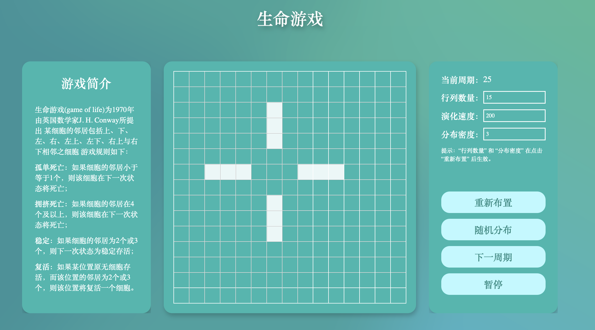

# 生命游戏

## Bash 演示

[生命游戏](http://nonoas.gitee.io/webproj/LifeGame/)没有游戏玩家各方之间的竞争，也谈不上输赢，可以把它归类为仿真游戏。事实上，也是因为它模拟和显示的图像看起来颇似生命的出生和繁衍过程而得名为“生命游戏”。在游戏进行中，杂乱无序的细胞会逐渐演化出各种精致、有形的结构；这些结构往往有很好的对称性，而且每一代都在变化形状。一些形状一经锁定就不会逐代变化。有时，一些已经成形的结构会因为一些无序细胞的“入侵”而被破坏。但是形状和秩序经常能从杂乱中产生出来。

每个方格中都可放置一个生命细胞，每个生命细胞只有两种状态：

“生”或“死”。用黑色方格表示该细胞为“生”，空格(白色)表示该细胞为“死”。或者说方格网中黑色部分表示某个时候某种“生命”的分布图。生命游戏想要模拟的是：随着时间的流逝，这个分布图将如何一代一代地变化。

